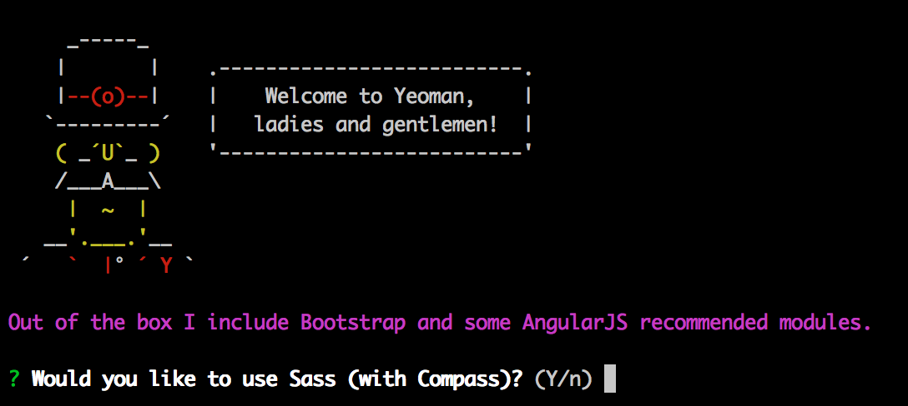

# Branchsters Web

The [Branch Web SDK](https://github.com/BranchMetrics/Web-SDK) is a simple and powerful tool to empower your Web App with Branch deep link generation, tracking, attritubtion, referrals, and rewards. The entire SDK is only ~7K gzipped of vanilla JS, and requires no outside dependencies. The SDK has thourough documentation in the README, however, we know many engineers like to learn best by example. So we've made a simple single page web app and accompanying tutorial, as a simple example of the major features of the [Branch Web SDK](https://github.com/BranchMetrics/Web-SDK).

This example is written with [AngularJS](https://angularjs.org/) and [Bootstrap](http://getbootstrap.com/), and the project was started and managed with [Yeoman](http://yeoman.io/). Aren't familiar with AngularJS? That's OK, we just assume you have some JavaScript knowledge. We also have examples with other frameworks, like [React](http://facebook.github.io/react/), on the way. If you're not familiar with Yeoman, that's also OK - it's essentially a three prong bundle which includes: generators for starting projects (over 1000 available now), [Bower](http://bower.io/) for installing and managing dependencies (Including the Branch Web SDK!), and [Grunt](http://gruntjs.com/) for build and development tasks, live reload, etc.

#### Tools and frameworks used in this tutorial
- [Sublime Text](http://www.sublimetext.com/)
- [Node](http://nodejs.org/)
- [npm (Node package manager)](https://www.npmjs.com/)
- [Yeoman](http://yeoman.io/)
- [Bower](http://bower.io/)
- [Grunt](http://gruntjs.com/)
- [AngularJS](https://angularjs.org/)
- [Bootstrap](http://getbootstrap.com/)
- [git](http://git-scm.com/)

##### **Note: If you are unfamiliar with any tools in this list, background information is given on these topics in a box. Otherwise, feel free to skip that information to get to the meat.**

### Getting Started

First of all, we'll assume you have all of the tools and frameworks listed above installed. If you need help with any of them, Yeoman has a great summary of setting up a dev environment with what we'll be using [here](http://yeoman.io/codelab/setup.html).

##### 1. Install the Yeoman [AngularJS generator](https://www.npmjs.org/package/generator-angular)
Open your favorite Bash terminal, and enter the following command:
```
npm install --global generator-angular
```
*Note: --global installs this generator globally, you may need sudo for the proper permissions. Or feel free to install it locally to your project by omitting the option*

##### 2. Create a project folder and run the generator
```
mkdir Branchster-Web && cd Branchster-Web
```
Pick your directory name carefully, as the AngularJS generator will use this as the namespace for your app! For example, this directory name will produce: ```angular.module('Branchster-Web', [])```

Now that you're in the project directory, let's run the AngularJS generator!
```
yo angular
```

Yeoman (yo), will now ask us a series of questions as so:


For Branchsters, we'll answer the questions as so:
```
Would you like to use Sass (with Compass)? No
Would you like to include Bootstrap? Yes
❯◉ angular-animate.js
 ◉ angular-cookies.js
 ◉ angular-resource.js
 ◉ angular-route.js
 ◯ angular-sanitize.js
 ◉ angular-touch.js
```
*Tip: Select and deselect options in the Angular library list with the up and down arrow keys and the spacebar.*

And now a bunch of magic will happen (this is where you see the real value of Yeoman). Yeoman will automatically setup a directory scaffolding, and install the proper npm and bower packages! This is a great point to go grab a cub of coffee, as it will take a few minutes to install everything.


