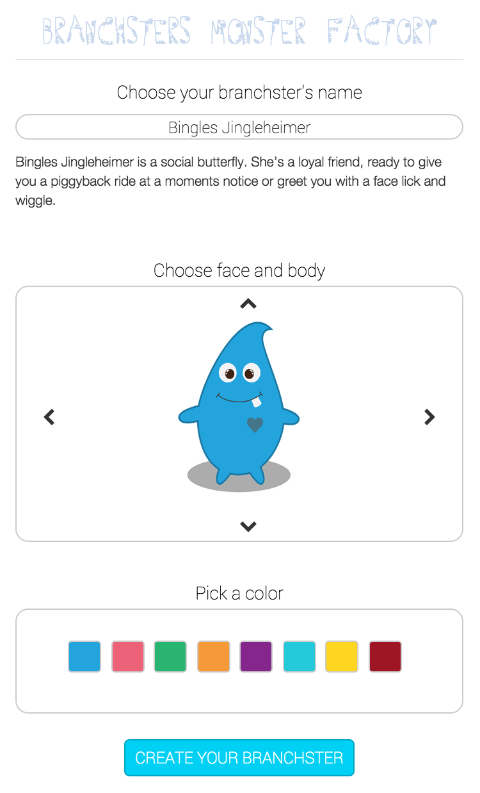
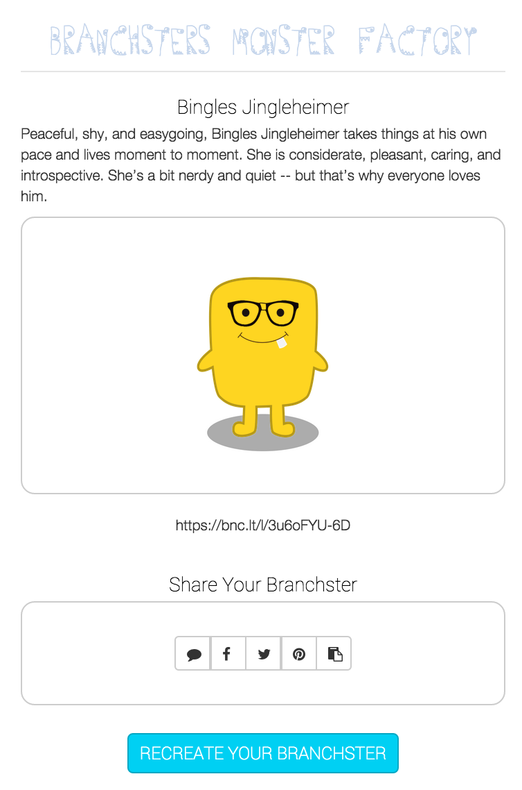

# Branchsters Web

The [Branch Web SDK](https://github.com/BranchMetrics/Web-SDK) is a simple and powerful tool to empower your Web App with Branch deep link generation, tracking, attritubtion, referrals, and rewards. The entire SDK is only ~7K gzipped of vanilla JS, and requires no outside dependencies. The SDK has thourough documentation in the README, however, we know many engineers like to learn best by example. So we've made a simple single page web app and accompanying tutorial, as a simple example of the major features of the [Branch Web SDK](https://github.com/BranchMetrics/Web-SDK).

This example is written with [AngularJS](https://angularjs.org/) and [Bootstrap](http://getbootstrap.com/), and the project was started and managed with [Yeoman](http://yeoman.io/). Aren't familiar with AngularJS? That's OK, we just assume you have some JavaScript knowledge. We also have examples with other frameworks, like [React](http://facebook.github.io/react/), on the way. If you're not familiar with Yeoman, that's also OK - it's essentially a three prong bundle which includes: generators for starting projects (over 1000 available now), [Bower](http://bower.io/) for installing and managing dependencies (Including the Branch Web SDK!), and [Grunt](http://gruntjs.com/) for build and development tasks, live reload, etc.

#### What we're going to build:


A live example of this app can be [found here](http://cdn.branch.io/branchster-angular).

If you're only interested in seeing the example Branch Web SDK integration with Branchsters, skip to [step 4](#4-install-the-branch-web-sdk).

#### Tools and frameworks used in this tutorial
- [Sublime Text](http://www.sublimetext.com/)
- [Node](http://nodejs.org/)
- [npm (Node package manager)](https://www.npmjs.com/)
- [Yeoman](http://yeoman.io/)
- [Bower](http://bower.io/)
- [Grunt](http://gruntjs.com/)
- [AngularJS](https://angularjs.org/)
- [Bootstrap](http://getbootstrap.com/)
- [git](http://git-scm.com/)

### Getting Started

First of all, we'll assume you have all of the tools and frameworks listed above installed. If you need help with any of them, Yeoman has a great summary of setting up a dev environment with what we'll be using [here](http://yeoman.io/codelab/setup.html).

If you'd like to follow along with the codebase, starting with step 3 (nothing much exists in the codebase before that), each commit is tagged with "STEP #".

##### 1. Install the Yeoman [AngularJS generator](https://www.npmjs.org/package/generator-angular)
Open your favorite Bash terminal, and enter the following command:
```
$ npm install --global generator-angular
```
*Note: --global installs this generator globally, you may need sudo for the proper permissions. Or feel free to install it locally to your project by omitting the option*

##### 2. Create a project folder and run the generator
```
$ mkdir Branchster-Web && cd Branchster-Web
```
Pick your directory name carefully, as the AngularJS generator will use this as the namespace for your app! For example, this directory name will produce: ```angular.module('Branchster-Web', [])```

Now that you're in the project directory, let's run the AngularJS generator!
```
$ yo angular
```

Yeoman (yo), will now ask us a series of questions as so:


For Branchsters, we'll answer the questions as so:
```
Would you like to use Sass (with Compass)? No
Would you like to include Bootstrap? Yes
❯◉ angular-animate.js
 ◉ angular-cookies.js
 ◉ angular-resource.js
 ◉ angular-route.js
 ◯ angular-sanitize.js
 ◉ angular-touch.js
```
*Tip: Select and deselect options in the Angular library list with the up and down arrow keys and the spacebar.*

And now a bunch of magic will happen (this is where you see the real value of Yeoman). Yeoman will automatically setup a directory scaffolding, and install the proper npm and bower packages! This is a great point to go grab a cub of coffee, as it will take a few minutes to install everything.

##### Live Reload
Now that Yeoman has setup the scaffolding for a basic Angular app, and setup some basic grunt tasks, run the following command:
```
$ grunt serve
```

Grunt will serve a live version of your app on port 9000, that automatically refreshses anytime files are changed! Try changing some files to see this working, as it will ome in very useful when we are styling Branhsters.

##### 3. Modify the Boilerplate generated Angular Boilerplate

First, let's some modifications to the boilerplate Yeoman Angular template.

**The changes by file and line number**

##### app/index.html
- 5: *add* ```<title>Branchsters Web</title>```
- 26...30: *remove* ```<ul class="nav nav-pills pull-right">...</ul>```
- 31: *change to* ```<h3 class="text-muted">Branchsters Monster Factory</h3>```
- 37: *change to* ```<p><span class="glyphicon glyphicon-heart"></span> from the <a href="http://branch.io">Branch Metrics team</a></p>```
- 75: *remove* ```<script src="scripts/controllers/about.js"></script>```

##### app/views/main.html
- 2...22: *remove all, leaving just* ```html <div class="jumbotron"></div>```

##### app/scripts/app.js
- 25...28: *remove all*

##### app/scripts/controllers/main.js
- 12...16: *remove all* ```$scope.awesomeThings...];```

There are also some files we can delete:
```
$ rm app/views/about.html app/favicon.ico app/images/yeoman.png app/scripts/controllers/about.js
```


We'll be using some icons from [Font Awesome](http://fontawesome.io/), which can easily be installed with Bower:

```
$ bower install --save fontawesome
```

##### 4. Build the Branchster interface

First, let's write the JavaScript that will let the user build their Branchster. Insert the following code starting at line 11, just after `.controller('MainCtrl', function ($scope) {`

app/scripts/controllers/main.js
```
// available branchster colors
$scope.colors = [ '#24A4DD', '#EC6279', '#29B471', '#F69938', '#84268B', '#24CADA', '#FED521', '#9E1623' ];

// loops through indices for the body and face, between 0 and max
$scope.loopIncrement = function(amount, index, max) {
	amount = (index === 0 && amount === -1) ? max : amount;
	amount = (index === max && amount === 1) ? -1 * max : amount;
	return amount;
};

// selected branchster on load
$scope.selectedFaceIndex = 0;
$scope.selectedBodyIndex = 0;
$scope.selectedColorIndex = 0;

$scope.switchColor = function(color) {
	$scope.selectedColorIndex = color;
};

$scope.incrementFace = function(amount) {
	$scope.selectedFaceIndex += $scope.loopIncrement(amount, $scope.selectedFaceIndex, 3);
};

$scope.incrementBody = function(amount) {
	$scope.selectedBodyIndex += $scope.loopIncrement(amount, $scope.selectedBodyIndex, 3);
};
```

##### Explanation
This code is fairly straightforward. Essentially, there are 3 indices that control what the Branchster looks like, `selectedFaceIndex`, `selectedBodyIndex`, and `selectedColorIndex`. These three indicies are incremented and decremented by the methods `switchColor`, `incrementFace`, and `incrementBody`. The method `switchColor` accepts one argument, which is the index of the desired color in the `colors` array. This is set by clicking one of the color buttons, as seen in the HTML below. The methods `incrementFace` and `incrementBody` accepts one argument: an increment amount (either a 1, or a -1). This value is passed into `loopIncrement`, which loops through the available bodies and faces, i.e. if the current value of `selectedFaceIndex` is 3 (the maximum - last available face) and an increment amount of +1 is recieved, it will return 0, looping back to the beginning of available faces.

##### HTML for interface

app/views/main.html
```
<form>
	<div class="form-group">
		<label for="name" class="branchsters-heading">Choose your branchster's name</label>
		<input type="text" class="form-control" id="name" name="name" placeholder="John">
	<div class="form-group">
		<label for="body" class="branchsters-heading">Choose face and body</label>
		<div class="jumbotron branchsters-body-container branchsters-square" name="body">
			<!-- monster components -->
			</img>
			</img>
			</img>
			<!-- arrows -->
			<i class="fa fa-chevron-left fa-2x branchsters-arrow branchsters-left-arrow" ng-click="incrementFace(-1)"></i>
			<i class="fa fa-chevron-right fa-2x branchsters-arrow branchsters-right-arrow" ng-click="incrementFace(1)"></i>
			<i class="fa fa-chevron-up fa-2x branchsters-arrow branchsters-up-arrow" ng-click="incrementBody(-1)"></i>
			<i class="fa fa-chevron-down fa-2x branchsters-arrow branchsters-down-arrow" ng-click="incrementBody(1)"></i>
		</div>
	</div>
	<div class="form-group">
		<label for="color" class="branchsters-heading">Pick a color</label>
		<div class="jumbotron branchsters-square" name="color">
			<div class="btn-group btn-group-lg" role="group" ng-repeat="color in colors">
				<button type="button" class="btn btn-default" ng-model="color" ng-click="switchColor($index)" ng-style="{'background-color': color}"></button>
			</div>
		</div>
	</div>
	<div class="form-group branchsters-heading">
		<button type="button" class="btn btn-default btn-lg btn-success" id="branchsters-create-button">CREATE YOUR BRANCHSTER</button>
	</div>
</form>
```

##### Styles for interface

app/styles/main.css
```

/* Branchsters classes */
input[type="text"] {
	color: #555;
	text-align: center;
	margin-top: 10px;
	padding: 0px 30px;
	font-size: 25px;
	color: #333;
	font-family: 'Roboto', Arial;
	font-weight: 100;
	width: 100%;
	border: 1px solid #ccc;
	border-radius: 20px;
	background: #FFF;
	height: 40px;
	box-sizing: border-box;
}

.header {
	margin-bottom: 0 !important;
}

h3 {
	font-size: 40px;
	font-weight: 500 !important;
	color: #c6d6ec !important;
}

.branchsters-heading {
	font-family: 'Roboto', Arial;
	font-size: 28px;
	color: #000;
	font-weight: 100;
	text-align: center;
	width: 100%;
	padding-top: 30px;
}

.branchsters-body-container {
	  position: relative;
	  height: 400px;
}

.branchsters-bodypart {
	width: 200px;
	height: 300px;
	position: absolute;
	margin-left: -100px;
}

.branchsters-square {
	border: 1px solid #CCC;
	border-bottom: 1px solid #CCC !important;
	border-style: solid;
	background-color: #fff;
	border-radius: 20px !important;
}

#brachsters-name {
	margin-bottom: 20px;
}

#branchsters-face {
	z-index: 3;
}

#branchsters-description {
	height: 115px;
}

#branchsters-body {
	z-index: 2;
}

#branchsters-display-link {
	text-align: center;
	height: 30px;
}

.branchsters-bodycolor {
	z-index: 1;
}

.branchsters-color-button {
	margin-right: 15px;
	margin-bottom: 15px;
}

.branchsters-arrow {
	cursor: pointer !important;
}

.branchsters-left-arrow {
	position: absolute;
	top: 190px;
	left: 40px;
}

.branchsters-right-arrow {
	position: absolute;
	top: 190px;
	right: 40px;
}

.branchsters-up-arrow {
	position: absolute;
	top: 10px;
}

.branchsters-down-arrow {
	position: absolute;
	bottom: 10px;
}

.branchsters-share-icon {
	vertical-align: top;
	margin-left: -8px;
}

.branchsters-button {
	text-transform: uppercase;
	border-radius: 8px;
	font-family: 'Roboto', Arial;
	color: #FFF;
	text-decoration: none;
	font-size: 25px;
	font-weight: 100;
}

#branchsters-create-button {
	top: -20px;
	position: relative;
	
	background: #00D0F3;
	border-color: #00A7C3;
}
```

##### 4. Install the Branch Web SDK

Once again, we're going to make use of Bower to install the Branch Web SDK.

Let's go grab it with:
```
$ bower install --save branch-web-sdk
```
This will automatically add a script tag to the bottom of your index.html file:
```
<script src="bower_components/branch-web-sdk/dist/build.js"></script>
```

You'll also need to initialize the SDK with your App Key. Per the Branch Web SDK instructions, include this tag at the bottom of your index.html, after the `<script>` tag Bower added:
```
<script type="text/javascript">
	(function(b,r,a,n,c,h,_,s,d,k){if(!b[n]||!b[n]._q){for(;s<_.length;)c(h,_[s++]);d=r.createElement(a);d.async=1;d.src="https://cdn.branch.io/branch-v1.2.0.min.js";k=r.getElementsByTagName(a)[0];k.parentNode.insertBefore(d,k);b[n]=h}})(window,document,"script","branch",function(b,r){b[r]=function(){b._q.push([r,arguments])}},{_q:[],_v:1},"init data setIdentity logout track link sendSMS referrals credits redeem banner".split(" "),0);

	branch.init('APP-KEY', function(err, data) {
	    // callback to handle err or data
	});
</script>
```
**Be sure to replace `APP-KEY` with the actual app key found in your [Branch dashboard](https://dashboard.branch.io/#/settings)**

##### 5. Integrate the Branch SDK

We're now setup to add more functionality to our app, and integrate the Branch Web SDK. The SDK attaches an instance of itself to the global `window` object as `branch` - which will be accessible inside of the Angular controller.

As part of this integration, we want an easy way of using the Facebook JS SDK to let our Branchster users share their Branchsters on Facebook. This can be easily accomplished with the angular-facebook module, so let's install that:
```
$ bower install --save angular-facebook
```

You'll see below, that we also need to add this as a dependency to our controller using Angular array notation. Let's add a few more methods to the Angular controller, and refactor our code to keep things DRY. We've also added a call to `branch.banner` in the `createBranchster` method. This displays a smart banner on desktop that has an SMS link form, and on mobile devices a link to the native app in the Android and iOS app stores. For a deeper explanation of smart banners, see the [app banner integration guide](https://github.com/BranchMetrics/Branch-Integration-Guides/blob/master/smart-banner-guide.md#app-banner).

app/scripts/controllers/main.js
```
angular.module('branchsterWebApp')
	.config(function(FacebookProvider) {
		 FacebookProvider.init('348703352001630');
	})
  .controller('MainCtrl', ['$scope', '$timeout', 'Facebook', 'utilities', function ($scope, $timeout, Facebook, utilities) {

  	$scope.updateDescription = function() {
    	$scope.description = utilities.getDescription($scope);
    };

  	$scope.init = function() {
  		// available branchster colors
	    $scope.colors = [ '#24A4DD', '#EC6279', '#29B471', '#F69938', '#84268B', '#24CADA', '#FED521', '#9E1623' ];

	    // descriptions of Branchster for each face
	    $scope.descriptions = [
			'$name is a social butterfly. She’s a loyal friend, ready to give you a piggyback ride at a moments notice or greet you with a face lick and wiggle.',
			'Creative and contagiously happy, $name has boundless energy and an appetite for learning about new things. He is vivacious and popular, and is always ready for the next adventure.',
			'$name prefers to work alone and is impatient with hierarchies and politics.  Although he’s not particularly social, he has a razor sharp wit (and claws), and is actually very fun to be around.',
			'Independent and ferocious, $name experiences life at 100 mph. Not interested in maintaining order, he is a fierce individual who is highly effective, successful, and incredibly powerful.',
			'Peaceful, shy, and easygoing, $name takes things at his own pace and lives moment to moment. She is considerate, pleasant, caring, and introspective. She’s a bit nerdy and quiet -- but that’s why everyone loves him.'
		];

		// default name
	    $scope.defaultName = 'Bingles Jingleheimer';

		// selected branchster on load
	    $scope.selectedFaceIndex = 0;
	    $scope.selectedBodyIndex = 0;
	    $scope.selectedColorIndex = 0;
	    $scope.branchsterName = $scope.defaultName;
	    $scope.updateDescription();

	    // Links
	    $scope.phone = '';
	    $scope.smsLink = '';
	    $scope.displayLink = '';
	    $scope.clipboardLink = '';

	    // Interface
        $scope.interfaceResetTime = 3000;
        $scope.smsError = false;
        $scope.showSMSSent = false;
        $scope.loaded = false;
  	};

  	$scope.load = function(data) {
  		// Interface
		$timeout(function() {
			$scope.showEditor = true;
	  		$scope.loaded = true;

	  		// Load Branchster
	  		/*jshint -W069 */
	  		$scope.selectedFaceIndex = data['face_index'] || $scope.selectedFaceIndex;
		    $scope.selectedBodyIndex = data['body_index'] || $scope.selectedBodyIndex;
		    $scope.selectedColorIndex = data['color_index'] || $scope.selectedColorIndex;
			$scope.branchsterName = data['monster_name'] || $scope.branchsterName;
			/*jshint +W069 */
		});
  	};

    $scope.switchColor = function(color) {
    	$scope.selectedColorIndex = color;
    };

    $scope.incrementFace = function(amount) {
    	$scope.selectedFaceIndex += utilities.loopIncrement(amount, $scope.selectedFaceIndex, 4);
    	$scope.description = utilities.getDescription($scope);
    };

    $scope.incrementBody = function(amount) {
    	$scope.selectedBodyIndex += utilities.loopIncrement(amount, $scope.selectedBodyIndex, 4);
    };

    $scope.createBranchster = function() {
		$scope.showEditor = false;
		$scope.branchsterName = $scope.branchsterName || $scope.defaultName;
		window.branch.banner({
			title: 'Branchsters',
			description: 'Get the app!',
			icon: 'images/icons/icon3.png'
		}, {
			channel: 'banner',
			feature: 'share',
			tags: [ 'desktop_creator' ],
			data: utilities.linkData($scope)
		});
		$scope.makeLink('display');
    };

    $scope.recreateBranchster = function() {
    	$scope.showEditor = true;
    };

	$scope.onTextClick = function ($event) {
		$event.target.select();
	};

    $scope.makeLink = function(channel) {
    	utilities.resetShows($scope);
    	$scope.interfaceWait = true;
		window.branch.link({
			channel: channel,
			feature: 'share',
			tags: [ 'desktop_creator' ],
			data: utilities.linkData($scope)
		}, function(err, link) {
			$timeout(function() {
				if (channel === 'sms') {
					$scope.showSMS = true;
					$scope.smsLink = link;
				} 
				else if (channel === 'display') {
					$scope.displayLink = link;
				}
				else if (channel === 'clipboard') {
					$scope.showClipboard = true;
					$scope.clipboardLink = link;
				}
				else if (channel === 'twitter') {
					utilities.popup(
						'https://twitter.com/intent/tweet?text=Check%20out%20my%20Branchster%20name%20' + $scope.branchsterName + '&url=' + link + '&original_referer=',
						{
							width: 848,
							height: 645,
							name:'twitter',
						}
					);
				}
				else if (channel === 'pinterest') {
					utilities.popup(
						'http://pinterest.com/pin/create/link/?url=' + link,
						{
							width: 800,
							height: 550,
							name:'pinterest',
						}
					);
				}
				else if (channel === 'facebook') {
					$scope.facebookLink = link;
					Facebook.ui({
						method: 'share_open_graph',
						/*jshint camelcase: false */
						action_type: 'og.likes',
						action_properties: JSON.stringify({
							object: link,
						}),
					}, function(response){ console.log(response); });
				}
				$scope.interfaceWait = false;
			});
		});
    };

    $scope.sendSMS = function() {
    	if ($scope.phone) {
    		$scope.interfaceWait = true;
    		window.branch.sendSMS(
			$scope.phone,
			{ data: utilities.linkData($scope) },
			{
				/*jshint camelcase: false */
				make_new_link: false
			},
			function(err) {
				$timeout(function() {
					if (err) {
						utilities.flashState($scope, 'smsError', $scope.interfaceResetTime);
					}
					else {					
						utilities.flashState($scope, 'showSMSSent', $scope.interfaceResetTime);
					}
				});
			});
    	}
    	else {
    		utilities.flashState($scope, 'smsError', $scope.interfaceResetTime);
    	}
    };

    // Inititate the app
    $scope.init();
    window.branch.init('36930236817866882', function(err, data) {
    	if (!err) {
    		$scope.load(data);
    	}
	});
}]);

```
##### Explanation
All default values, and the colors and descriptions array have been added to an `init` function. We've also added a `loaded` function, that triggers showing the interface, and any Branchster provided by the Branch link. We trigger this by moving the `window.branch.init` function from the include tag in `index.html`, to the bottom of the controller. So let's remove that from `index.html`, leaving just:
```
<script type="text/javascript">
	(function(b,r,a,n,c,h,_,s,d,k){if(!b[n]||!b[n]._q){for(;s<_.length;)c(h,_[s++]);d=r.createElement(a);d.async=1;d.src="https://cdn.branch.io/branch-v1.2.0.min.js";k=r.getElementsByTagName(a)[0];k.parentNode.insertBefore(d,k);b[n]=h}})(window,document,"script","branch",function(b,r){b[r]=function(){b._q.push([r,arguments])}},{_q:[],_v:1},"init data setIdentity logout track link sendSMS referrals credits redeem banner".split(" "),0);
</script>
```

First, let's add a boolean that will trigger between an editing and a viewing mode in the view, called `showEditor`, that defaults to `true`. We can then bind elements in the interface using `ng-show` and `ng-hide` to easily switch between the two modes. Next, we'll define an object literal of the link data we want to send to Branch, namely, the parameters that make our Branchster.

The next two methods, `createBranchster` and `recreateBranchster` switch between the editing and viewing modes of our interface, toggling `showEditor`, and also showing the universal app banner that is part of the Branch Web SDK. The last function, `makeLink`, takes a single argument of `channel` and will be called by 4 sharing buttons: Facebook, Twitter, Email, and SMS. Until we build a way of sharing the generated links, let's just output them to the console for testing.

The functions following that, `switchColor`, `incrementFace`, and `incrementBody`, are called by the Branchster editor to switch the body parts and color. The functions `createBranchster` and `recreateBranchster`, are called by the viewer and the editor to switch between editing, and viewing. `onTextClick` is called by the pastboard sharing box to let the user easily select the entire generated link by clicking on it. And finally, `sendSMS` is called by the SMS link sending form.

You'll notice we've injected a `utilities` Angular service in the updated controller. Many of the functions are more universal "utility" than one-time use functions that are called directly from the view, so it makes more sense to move them to an outside dependency we can call with the goal of keeping our controller DRY.

To help us with making a service, Yeoman Angular includes a generator for services, so let's use that:
```
$ yo angular:service utilities
```

Then, open up the generated `app/scripts/services/utilities.js`, and modify it to:
```
angular.module('branchsterWebApp')
	.service('utilities', ['$timeout', function ($timeout) {
		this.popup = function(url, popupOptions) {
			var left = (window.innerWidth  - popupOptions.width)  / 2,
			top = (window.innerHeight - popupOptions.height) / 2,
			options = 'status=1' +
				',width='  + popupOptions.width  +
				',height=' + popupOptions.height +
				',top='    + top    +
				',left='   + left;

			window.open(url, popupOptions.name, options);
		};

		// loops through indices for the body and face, between 0 and max
		this.loopIncrement = function(amount, index, max) {
	    	amount = (index === 0 && amount === -1) ? max : amount;
			amount = (index === max && amount === 1) ? -1 * max : amount;
			return amount;
	    };

	    this.linkData = function(scope) {
	    	return {
				'color_index': scope.selectedColorIndex,
				'body_index': scope.selectedBodyIndex,
				'face_index': scope.selectedFaceIndex,
				'monster_name': scope.branchsterName,
				'monster': true,
				'$desktop_url': 'http://cdn.branch.io/branchster-angular/',
				'$og_title': 'My Branchster: ' + scope.branchsterName,
				'$og_description': scope.description,
				'$og_image_url': 'https://s3-us-west-1.amazonaws.com/branchmonsterfactory/' + scope.selectedColorIndex + scope.selectedBodyIndex + scope.selectedFaceIndex + '.png'
			};
		};

		this.resetShows = function(scope) {
	    	scope.showSMS = false;
		    scope.showClipboard = false;
	    };

	    this.getDescription = function(scope) {
			return scope.descriptions[scope.selectedFaceIndex].replace('$name', scope.branchsterName);
		};

		this.flashState = function(scope, state, flashTime) {
			scope[state] = true;
			scope.interfaceWait = false;
    		$timeout(function() {
				scope[state] = false;
			}, flashTime);
		};
	}]);
```
##### Explanation
There are six functions here that we use more than once in the controller (or may use more than once in the future):
- **popup**: We'll use this to display Facebook, Twitter, and Pinterest share popups.
- **loopIncrement**: Moved from the controller, as it is not directly called by the view.
- **linkData**: Moved from the controller, as it is not directly called by the view.
- **resetShows**: We'll group any booleans tied to an ng-show directive here.
- **getDescription**: Moved from the controller, as it is not directly called by the view. Returns the correctdescription for the current faceIndex, and name.
- **flashState**: Toggles a variable to `true`, then back to `false`, for the desired amount of time. Used to show error and success form feedback for 3000 miliseconds.

##### Custom Font

We have a really scarry looking custom font to use for the title (our users are making monsters after all). If we look at the Gruntfile around line 300, we see that the build phase already copies any files in `fonts/*` to `dist/fonts/*`. So let's `$ mkdir fonts`, and put our custom font in there - it's called Germs and in this repo for reference. Now we need to add a `@font-face` to the stylesheet:

```
/* Branchster font */
@font-face {
    font-family: 'germsmonsters';
    src: url('../fonts/Germs-webfont.eot');
    src: url('../fonts/Germs-webfont.eot?#iefix') format('embedded-opentype'),
         url('../fonts/Germs-webfont.woff2') format('woff2'),
         url('../fonts/Germs-webfont.woff') format('woff'),
         url('../fonts/Germs-webfont.ttf') format('truetype'),
         url('../fonts/Germs-webfont.svg#germsmonsters') format('svg');
    font-weight: normal;
    font-style: normal;
}
```

Let's also make an id style we can add to the page title:

```
#branchsters-title {
	font-family: 'germsmonsters';
	font-size: 60px;
}
```

Lastly, let's change line 23 of index.html:

```
<h3 id="branchsters-title" class="text-muted branchsters-heading">BRANCHSTERS MONSTER FACTORY</h3>
```

##### HTML for interface

Next, we need to update our interface. We need to add `ng-show` directives to all of the labels, inputs, and buttons that have to do with making a Branchster, and ng-hide directives to every element that has to do with viewing a Branchster. Additionally, we're adding a 'RECREATE BRANCHSTER' button with an `ng-hide` directive to toggle back to editing mode, and a button group of the four sharing options.

app/views/main.html
```
<div ng-hide="loaded" class="branchsters-heading">Loading...</div>
<form ng-show="loaded">
	<div class="form-group">
		<label for="name" ng-show="showEditor" class="branchsters-heading">Choose your bracnhster's name</label>
		<label for="name" ng-hide="showEditor" class="branchsters-heading">{{branchsterName}}</label>
		<input type="text" ng-show="showEditor" class="form-control" id="brachsters-name" name="name" placeholder="Name" ng-model="branchsterName">
		<p class="lead" id="branchsters-description" ng-bind="description"></p>
	<div class="form-group">
		<label for="body" ng-show="showEditor" class="branchsters-heading">Choose face and body</label>
		<div class="jumbotron branchsters-body-container branchsters-square" name="body">
			<!-- monster components -->
			</img>
			</img>
			</img>
			<!-- arrows -->
			<i class="fa fa-chevron-left fa-2x branchsters-arrow branchsters-left-arrow" ng-show="showEditor" ng-click="incrementBody(-1)"></i>
			<i class="fa fa-chevron-right fa-2x branchsters-arrow branchsters-right-arrow" ng-show="showEditor" ng-click="incrementBody(1)"></i>
			<i class="fa fa-chevron-up fa-2x branchsters-arrow branchsters-up-arrow" ng-show="showEditor" ng-click="incrementFace(-1)"></i>
			<i class="fa fa-chevron-down fa-2x branchsters-arrow branchsters-down-arrow" ng-show="showEditor" ng-click="incrementFace(1)"></i>
		</div>
	</div>
	<div ng-show="showEditor" class="form-group">
		<label for="color" class="branchsters-heading">Pick a color</label>
		<div class="jumbotron branchsters-square" name="color">
			<div class="btn-group btn-group-lg" role="group" ng-repeat="color in colors">
				<button type="button" class="btn btn-default branchsters-color-button" ng-model="color" ng-click="switchColor($index)" ng-style="{'background-color': color}"></button>
			</div>
		</div>
	</div>
	<div ng-hide="showEditor" class="form-group"  ng-class="{ 'has-error':smsError }">
		<p class="lead" ng-hide="showEditor" id="branchsters-display-link" ng-bind="displayLink"></p>
		<label for="color" class="branchsters-heading">Share Your Branchster</label>
		<div class="jumbotron branchsters-square">
			<div class="btn-group btn-group-lg" role="group">
				<button type="button" ng-disabled="interfaceWait" class="btn btn-default" ng-click="makeLink('sms')"><i class="fa fa-comment branchsters-share-icon"></i></i></button>
				<button type="button" ng-disabled="interfaceWait" class="btn btn-default" ng-click="makeLink('facebook')"><i class="fa fa-facebook branchsters-share-icon"></i></button>
				<button type="button" ng-disabled="interfaceWait" class="btn btn-default" ng-click="makeLink('twitter')"><i class="fa fa-twitter branchsters-share-icon"></i></button>
				<button type="button" ng-disabled="interfaceWait" class="btn btn-default" ng-click="makeLink('pinterest')"><i class="fa fa-pinterest branchsters-share-icon"></i></button>
				<button type="button" ng-disabled="interfaceWait" class="btn btn-default" ng-click="makeLink('clipboard')"><i class="fa fa-clipboard branchsters-share-icon"></i></button>
			</div>
			<!--- SMS -->
			<input type="text" ng-show="showSMS" ng-disabled="interfaceWait" class="form-control" id="phone" name="phone" placeholder="(999) 999-999" ng-model="phone">
			<button type="button" ng-show="showSMS" ng-disabled="interfaceWait" class="btn btn-default btn-success branchsters-button" ng-click="sendSMS()" id="branchsters-sms-send">Send</button>
			<span id="branchsters-sms-sent" ng-show="showSMSSent">SMS Sent!</span>

			<!-- Clipboard -->
			<input type="text" ng-show="showClipboard" class="form-control" ng-model="clipboardLink" ng-click="onTextClick($event)" readonly="readonly">
		</div>
	</div>
	<div class="form-group branchsters-heading">
		<button type="button" class="btn btn-default btn-lg btn-success branchsters-button" ng-show="showEditor" ng-click="createBranchster()" id="branchsters-create-button">CREATE YOUR BRANCHSTER</button>
		<button type="button" class="btn btn-default btn-lg btn-success branchsters-button" ng-hide="showEditor" ng-click="recreateBranchster()" id="branchsters-create-button">RECREATE YOUR BRANCHSTER</button>
	</div>
</form>
```

And lastly, a few more style additions for the elements we've added to `main.html`:

app/styles/main.css
```
...
#branchsters-sms-send {
	width: initial;
	padding-top: 8px;
	margin-top: 10px;
}

#branchsters-sms-sent {
	display: block;
	margin-top: 10px;
	color: green;
	font-size: 18px;
}
...
```

This gets us a functional app, that utilizes the Branch Web SDK to generate links that embed all required parameters for sharing users' Branchsters! Next, we'll incorporate the SMSLink method of the Branch Web SDK, and sharing functionality via SMS, Facebook, Twitter, Pinterest, clipboard, and SMS.



##### 5. Deploy

Of course we want actually users to access our Branchsters app, so we'll want to package this up for deployment. Prepping our code for production couldn't be easier, just run:
```
$ grunt
```

This executes the build command, which takes care of:
- Linting our code
- Running our tests (We haven't written any yet. But if we did, they would run!)
- Concatenating and inifying our scripts and styles to save on those network requests
- Optimizing images
- Compiling the output of any preprocessors we’re using
- Generally, just make the app lean

Now, if you want to preview the production build, just run:
```
$ grunt serve:dist
```

Which builds the same result as above, but also serves it out to preview in our browser. From here, it is up to you how you get the `/dist` folder onto a server.

##### Future direction
One obvious addition to this app, is local storage, so that the same Branchster shows when the user revisits the page. Since that doesn't directly have anything to do with the Branch Web SDK, we've omitted it for now.


Have any questions, or suggestions about this example? Shoot an email to [scott@branchmetrics.io](mailto:scott@branchmetrics.io)!
